# Install Maximo On Microsoft Azure and Amazon AWS

The [Maximo Application Suite](https://www.ibm.com/products/maximo) allows users to sign on to a single, integrated platform to access key monitoring, maintenance, and reliability applications across the business. 

Since the 8.x releases, MAS has been expanded to include [Manage](https://www.ibm.com/products/maximo/asset-management), the enterprise assets management application that exists in version 7.6.x and previous releases, and several new applications, Health, Monitor, [Predict](https://www.ibm.com/products/maximo/predictive-maintenance), [Visual Inspection](https://www.ibm.com/products/maximo/visual-inspection), IoT and the [mobile app](https://www.ibm.com/products/maximo/mobile-eam). While you can deploy MAS on-prem or in a public cloud, it requires [Red Hat's OpenShift](https://www.ibm.com/cloud/openshift) container platform as the underlying infrastructure. 

The diagram below is a high-level Maximo architecture and core components.

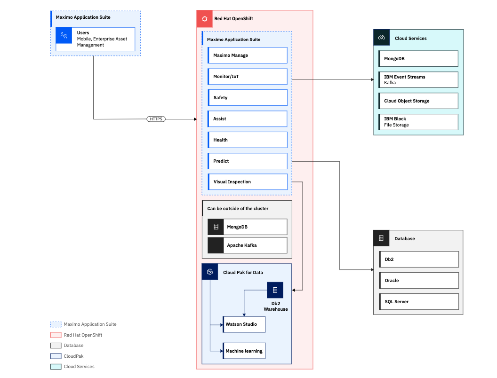

Before installing Maximo Application Suite (MAS 8.x or higher) on Microsoft Azure, check the [prerequisites](https://www.ibm.com/docs/en/mas-cd/continuous-delivery?topic=azure-overview), including Azure subscriptions, IBM Maximo license and entitlement key, Red Hat account and pull secret, domain and subdomain names for your OpenShift cluster.

You can install Maximo using the Bring Your Onn License (BYOL) option, or purchase Maximo from Azure Marketplace or AWS. You can install Maximo with a few options. To deploy Maximo on AWS, visit [IBM Maximo on AWS](https://aws.amazon.com/solutions/partners/ibm-maximo/). To deploy Maximo on Azure, visit [Deploy a Red Hat Azure OpenShift](https://learn.microsoft.com/en-us/azure/openshift/quickstart-portal).

1. New Red Hat® OpenShift® cluster by using the Installer Provisioned Infrastructure (IPI)
2. New Red Hat® OpenShift® cluster by using the User Provisioned Infrastructure (UPI)
3. Existing Red Hat® OpenShift® cluster

**This document covers the third option, installing MAS on an existing OpenShift cluster.** The primary purpose of this document is to share lessons learned. Readers should reference official documentation from IBM, Microsoft and Amazon for the latest updates.

Note that the code has been tested on a docker container on MacBook using a 5 worker-node OpenShift cluster hosted through IBM TechZone. To deploy MAS on a new cluster, you will need to obtain a domain name, e.g. xyz.com, and a subdomain name, e.g. azureocp.xyz.com, for the OpenShift cluster.

## Define Environment Variables

First, define the environment variables:

```
export MAS_INSTANCE_ID=poc10
export IBM_ENTITLEMENT_KEY=xxx
export MAS_CONFIG_DIR=/mascli/masconfig
export SLS_LICENSE_ID=xxx
export SLS_LICENSE_FILE=/mascli/masconfig/license.dat
export UDS_CONTACT_EMAIL=xxx@xxx.com
export UDS_CONTACT_FIRSTNAME=firstname
export UDS_CONTACT_LASTNAME=lastname
export UDS_STORAGE_CLASS=ocs-storagecluster-ceph-rbd
export OCP_INGRESS_TLS_SECRET_NAME=xxx-ingress
export DB2_INSTANCE_NAME=db2inst
export MAS_APP_ID=manage 
```

- MAS_INSTANCE_ID is an arbitrary string for the installation, e.g. inst1 
- IBM_ENTITLEMENT_KEY is the MAS license key from IBM.
- SLS_LICENSE_ID is a 12 digit hexadecimal number, e.g. 756A06D0C216. It is contained in the the MAS license key.
- MAS_CONFIG_DIR is the folder where the license keys are stored, e.g. masconfig, which is mapped to a docker container folder, e.g. /mascli/masconfig
- SLS_LICENSE_FILE is the license key file name and location, e.g. /mascli/masconfig/license.dat
- UDS_CONTACT_EMAIL can be your work or personal email address
- UDS_CONTACT_FIRSTNAME=firstname
- UDS_CONTACT_LASTNAME=lastname
- UDS_STORAGE_CLASS is the storage class used for MAS deployment, e.g. ocs-storagecluster-ceph-rbd
- OCP_INGRESS_TLS_SECRET_NAME is the ingress route tls certificate name. For Azure, you can find it from the OpenShift customer. For AWS, the default value is "letsencrypt-certs".
- DB2_INSTANCE_NAME is the db2 database instance name, e.g. db2inst
- MAS_APP_ID is manage if MAS Manage is to be installed

## Locate OpenShift Ingress Route Secret Name (Azure only)

The OCP_INGRESS_TLS_SECRET_NAME environment variable is optional in most cases, but it must be specified for the OpenShift cluster on Azure, mainly because it is a randomly assigned name. 

To find it, log in to the OpenShift cluster. Search "ingress" under Workloads | Secrets. Sort the list by Type. Note the name in the namespace of "openshift-ingress" and type of "kubernetes.io/tls", e.g. a85b5fa3-a6b3-4432-8b6d-b373773ce84e-ingress. 

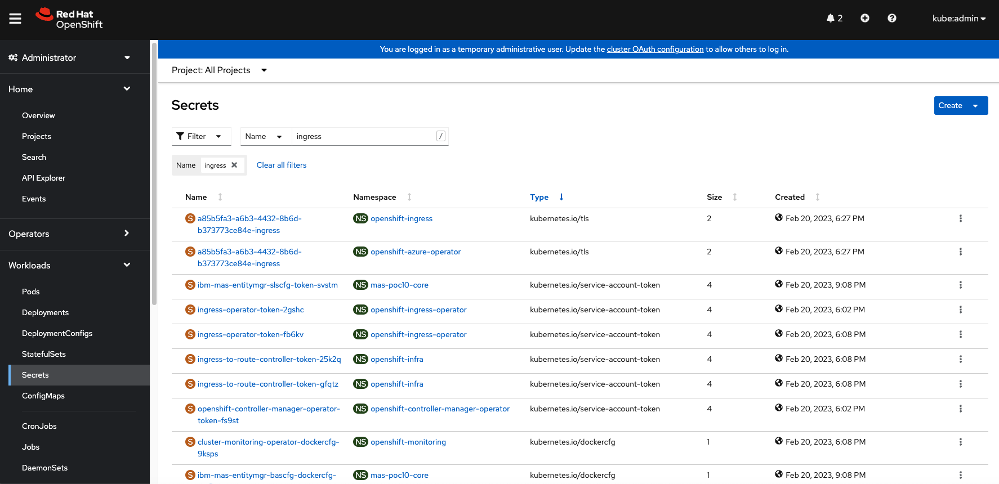

Alternatively, you can locate the name using the `oc` command.

```
oc get secrets -n openshift-ingress | grep ingress
```

## Install OpenShift® Data Foundation (ODF) Storage Classes (Azure only)

Maximo Application Suite and its dependencies require storage classes that support ReadWriteOnce (RWO) and ReadWriteMany (RWX) access modes:
  - ReadWriteOnce volumes can be mounted as read-write by multiple pods on a single node.
  - ReadWriteMany volumes can be mounted as read-write by multiple pods across many nodes.

By default, an OpenShift cluster on Azure comes with two storage classes. While it is possible to use them to run the Ansible playbooks, it is much easier to work with ODF, previously known as OpenShift Container Storage (OCS). 

  - Storage class (ReadWriteOnce): managed-csi
  - Storage class (ReadWriteMany): managed-premium

To install ODF, search "ODF" under Operators | OperatorHub from the OpenShift console. Choose the default options to complete the step. 

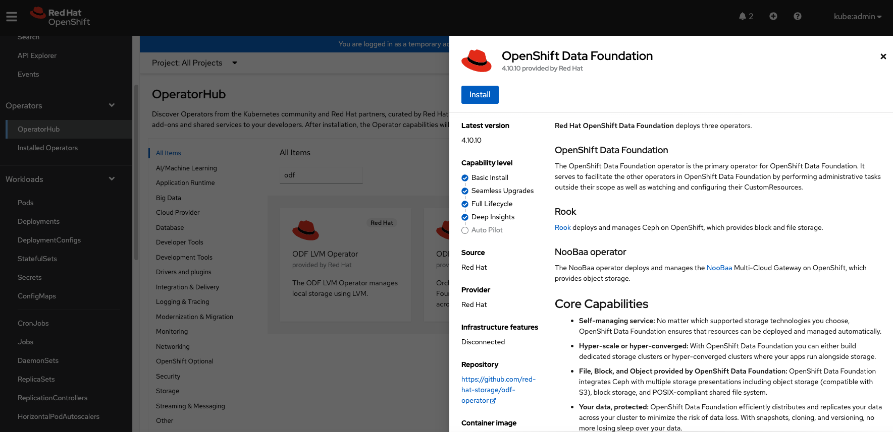

Once ODF is installed, create a StorageSystem instance. Create 2 TiB or more storage on at least 3 worker nodes.

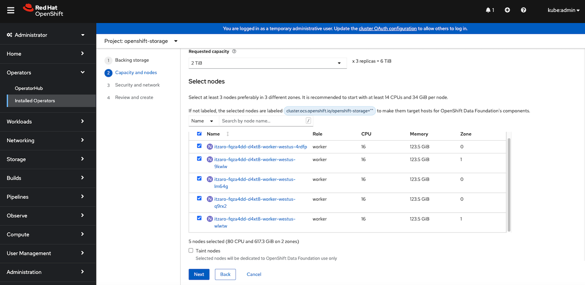

When the StorageSystem instance is created, three new storage classes are added. By default, the Ansible playbooks use the "
ocs-storagecluster-ceph-rbd" storage class.

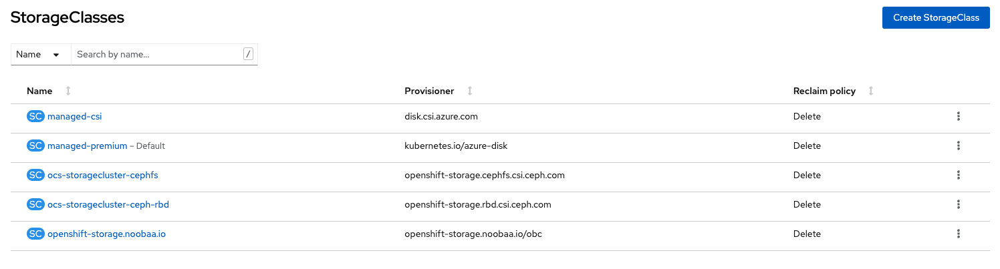

[!Note] Make sure that you allocate adequate resources for worker nodes. For more details, see [ODF Resource requirements](https://access.redhat.com/documentation/en-us/red_hat_openshift_data_foundation/4.10/html-single/planning_your_deployment/index#resource-requirements_rhodf).


## Start the Docker Container

Install docker on your computer, and run the docker command to launch the MAS cli instance. Alternatively, you can run Ansible playbooks locally, but the tradeoff is that you will need to install all dependencies, e.g python3. 

```
docker run -ti --rm --pull always -v ~/masconfig:/mascli/masconfig quay.io/ibmmas/cli
```

- ti: run the container interactively; allocate a pseud- TTY (pseudo terminals)​
- rm: remove the container when it exits​
- pull always: pull down image before running​
- v: bind mount a volume. Local machine folder “~/masconfig”; container folder: “/mascli/masconfig”​
- quay.io/ibmmas/cli: downloaded the mas cli image. Run "docker images" to see images available.

## Run Ansible Playbook to Install MAS Core

Log in to OpenShift and run the playbook to install MAS Core. This step may take one hour or longer. 

Make sure that you remove any yaml files from previous installations.

```
oc login --token=xxx --server=https://api.xxx.westus.aroapp.io:6443

ansible-playbook ibm.mas_devops.oneclick_core

```

Alternatively, you can run the playbook locally on a remote host, as explained in the [Ansible](https://docs.ansible.com/ansible/latest/playbook_guide/playbooks_delegation.html) documentation. The `-v` option is verbose mode (-vvv for more, -vvvv to enable connection debugging).

```
ansible-playbook ansible-devops/playbooks/oneclick_core.yml --connection=local -vvv
```

### Look Up MAS Admin URL and Superuser Credentials

Navigate to the Routes screen under Networking from the OpenShift console. Copy the admin URL in the namespace for the MAS installation.

Navigate to the Secrets screen under Workloads from the OpenShift console. Search "superuser", and open the one in the namespace for the MAS installation, e.g. "mas-poc10-core".

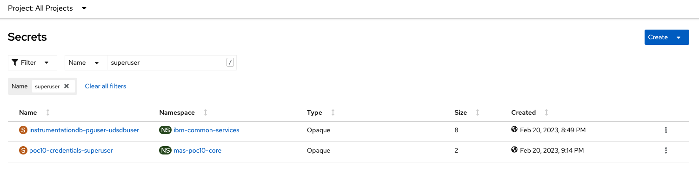

Copy the values for password and username. Note that the password appears first and username second. You will use them to log in to the Maximo administration app. 

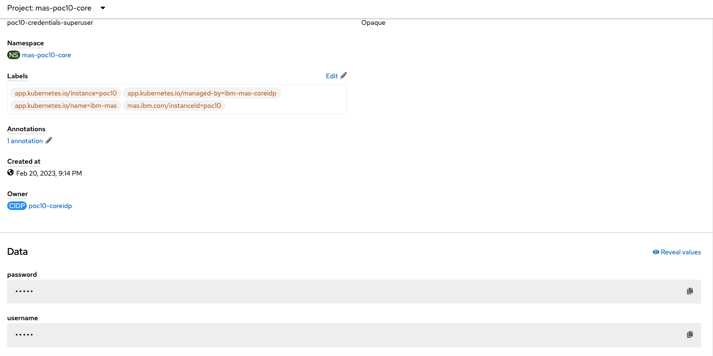

Alternatively, use the `oc` command to look up the superuser credentials.

```
oc get projects | grep core
oc get routes -n mas-xxx-core | grep admin
oc get secrets -n mas-xxx-core | grep superuser
oc get secret xxx-credentials-superuser -n mas-xxx-core  -o yaml
echo "<password encoded string>"| base64 -d
echo "<username encoded string>"| base64 -d
```

### Download and Configure MAS Certificate

When navigating to the Maximo administration console in the browser, you are prompted with the "NET::ERR_CERT_AUTHORITY_INVALID". That is because the self-signed certificate is not trusted on your computer. 

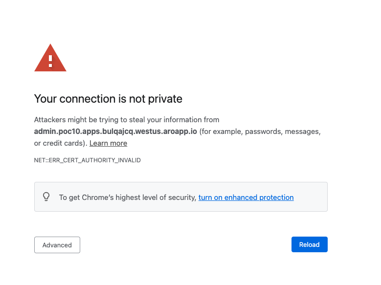

A quick workaround is that you press the "Advanced" button to continue and change "admin" to "api" in the URL address. You will see a screen with an error message that looks like the following. Change "api" back to "admin" in the URL address. You should land on the administration screen.

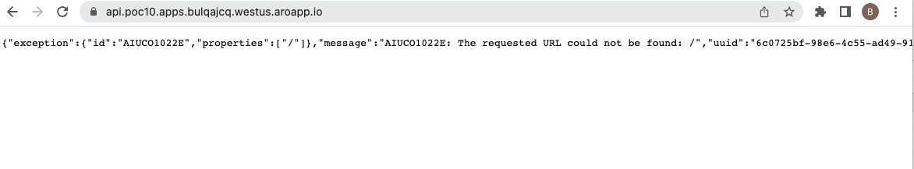

For Maximo deployment on Azure, it is necessary that the certificate issue be addressed permanently. Go to Routes under Networking from the OpenShift console. Select the MAS namespace, e.g. mas-poc10-core, and open the admin route screen.

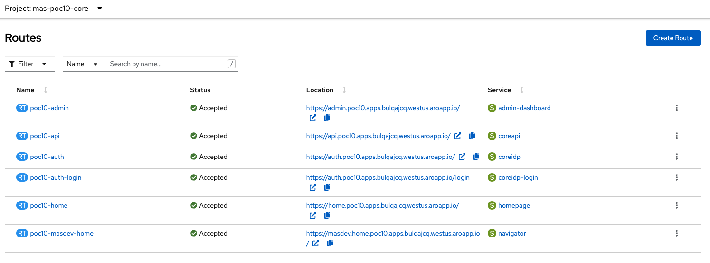

Scroll down the screen to find the CA certificate. Copy the certificate and save it in a file, e.g. "ca.crt".

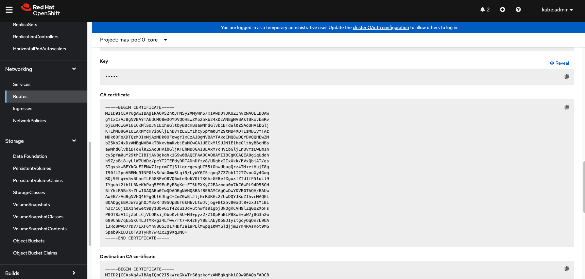

On the MacBook, open the Keychain Access setting. Click the import items from the File menu. Locate the certificate file and import it. Select the imported item from the list, which is likely named something like "public.poc10.mas.imb.com". Double click on it and change the value of "when using this certificate" under Trust to "Always trust". Save the setting by entering your MacBook login password if prompted. You will notice that the icon next to the name from a red "x" to to a blue "+".

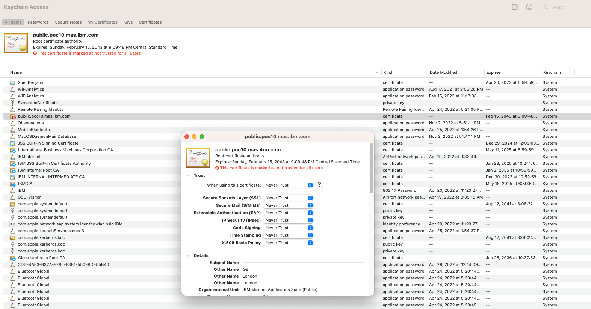

With that, you can open the Maximo administration application in the browser and log in without any certificate error prompt.

### Update User Data Service (Azure Only)

For Maximo deployment on Azure, you may notice an error from the command line that looks like the following. This error must be addressed before we activate the Manage application.

```
BAS configuration was unable to be verified: 
Connecting to BAS (verify=/tmp/bas.pem) at https://uds-endpoint-ibm-common-services.apps.bulqajcq.westus.aroapp.io failed: 
SSLError: HTTPSConnectionPool(host='uds-endpoint-ibm-common-services.apps.bulqajcq.westus.aroapp.io', port=443): 
Max retries exceeded with url: /v1/status (Caused by SSLError(SSLCertVerificationError(1, '[SSL: CERTIFICATE_VERIFY_FAILED] certificate verify failed: 
unable to get issuer certificate (_ssl.c:1131)')))
```

Log in to the Maximo administration console. Navigate to the admin with "/initialsetup", or click on the Configurations on the left side. We will need to update the URL, the AIP key, and the certificates. We will find these values from the OpenShift cluster.

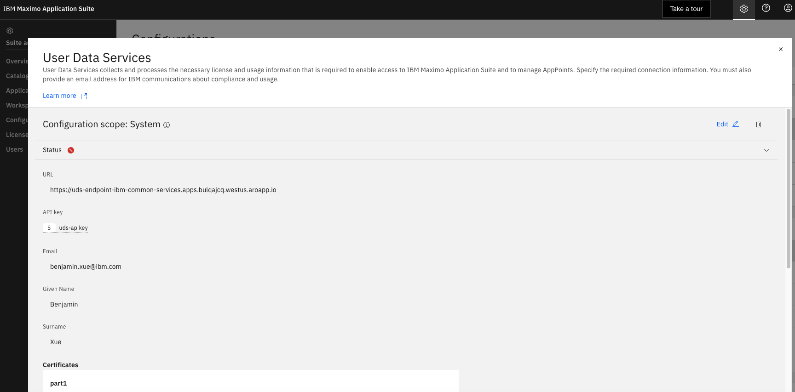

Navigate to Secrets under Workloads from the OpenShift console. Search "event-api". Open the "event-api-secrets" screen, and copy the apikey value. Then open the "event-api-certs" screen, and copy the tls.crt value. Note that there are two certificates in the text. The first part includes all the text starting with the text "-----BEGIN CERTIFICATE-----" and ending with "-----END CERTIFICATE-----". The second part is the remaining text.

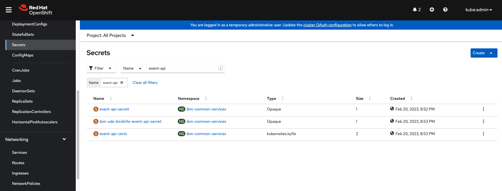

Alternatively, you can get apikey and certificates using the `oc` command.

```
oc get secrets -n ibm-common-services | grep event-api
oc get secret event-api-secret -n ibm-common-services -o yaml
oc get secret event-api-certs -n ibm-common-services -o yaml
echo "<apikey string>" | base64 -d
echo "<tls.cert string>" | base64 -d
```

Go back to the User Data Services (UDS) in the Maximo administration console. Open the edit screen.

- Replace the URL from the existing value, e.g. "https://uds-endpoint-ibm-common-services.apps.bulqajcq.westus.aroapp.io" to "".
- Replace the API key with the value you obtained previously.
- Delete three certificates named "part1", "part2" and "part3". Add the first certificate and name it "basCert1" using the first part of the certificates you obtained previously. Add the second certificate and name it "basCert2" using the second part of the certificates you obtained previously. Click "Confirm" to save the certificates. Click "Save" to save the changes.

The update of UDS settings may take 15 minutes and you will see a green status icon if successful. If it takes longer than that, chances are that the changes are not working and you will need to repeat the process with the correct values.

## Install DB2 and Activate MAS Manage

We are now ready to install and activate Maximo Manage. Run the Ansible playbook below. A DB2 database will be created automatically, and the Manage application will be deployed. This step can take two hours or longer.

```
ansible-playbook ibm.mas_devops.oneclick_add_manage
```

Note that if you want to use an existing database, you can skip this step and go the database configuration instead.

## Review and Connect to the Database

Navigate to the Configurations screen from the Maximo administration console. Open the database connection view and the edit screen. 

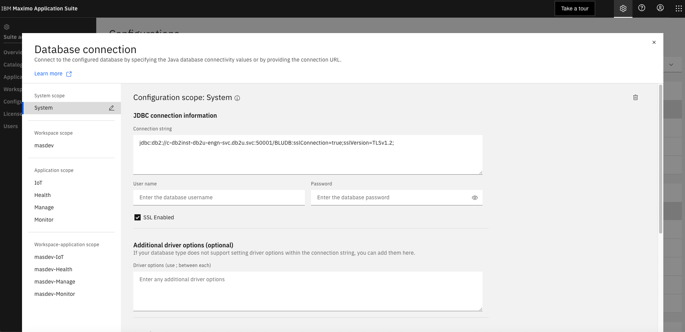

For IBM DB2 database, the connection string looks like the following. The default user name is "db2inst1". 

```
jdbc:db2://c-db2inst-db2u-engn-svc.db2u.svc:50001/BLUDB:sslConnection=true;sslVersion=TLSv1.2;
```
The password can be found in the Secrets under Workloads from the OpenShift Console. Search "password" in the namespace of "db2u". Open the "c-db2inst-instancepassword" screen and copy the password. If "SSL Enabled" is checked, make sure that the certificate has added. If not, you can find it from the "db2u-ca" secret in the namespace of "db2u".

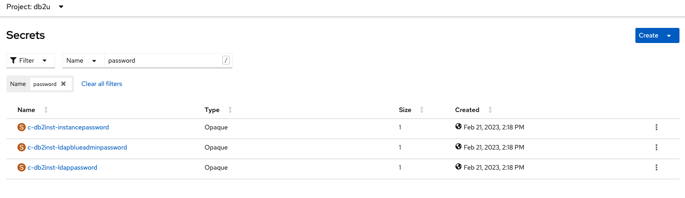

For Oracle database or Microsoft SQL Server database, obtain the connection string and user credentials and update them accordingly.

It's worth noting that while Maximo Manage supports different database types, including DB2, DB2 Warehouse, Oracle database and SQL Server database, some Maximo applications require DB2. Check out the [Prerequisite software](https://www.ibm.com/docs/en/mas-cd/continuous-delivery?topic=overview-prerequisite-software).

## Activate MAS Manage Manually

When using an external database, you can activate MAS Manage manually through the administration console. For more details, refer to the documentation on [Activating Maximo Manage](https://www.ibm.com/docs/en/maximo-manage/continuous-delivery?topic=manage-activating-maximo) or [Deploying and activating Maximo Manage](https://www.ibm.com/docs/en/maximo-manage/8.0.0?topic=suite-deploying-activating-manage).


## Log In to MAS Manage 

As aforementioned, you can find the admin or home URL addresses from the Routes and log in with the superuser credentials. Once logged in, you can create new users, or modify existing users. For example, you can change the password for the built-in user account, "maxadmin".

With user accounts like "maxadmin", not the superuser account, you can choose the Manage application or other applications by clicking the 9-dot AppSwitch icon from the upper right corner in the browser. 

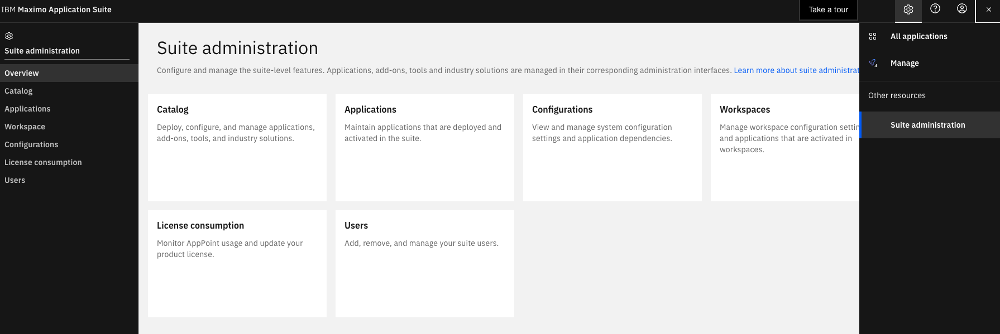

## Custom Domain Name and DNS Server 

You can configure a custom domain name for your applications on AWS. For more details, check [Configuring custom domains for applications](https://docs.openshift.com/rosa/applications/deployments/osd-config-custom-domains-applications.html), and [Implementing custom domain names with ROSA](https://aws.amazon.com/blogs/containers/implementing-custom-domain-names-with-rosa/).

When creating a Red Hat OpenShift cluster on Azure, you can specify the domain name, e.g. example.com. For more details, check [Deploy an Azure Red Hat OpenShift cluster](https://learn.microsoft.com/en-us/azure/openshift/quickstart-portal).

You can change the DNS server for an existing cluster on Azure. Run the `oc` command to determine eligibility. For more details, check [Configure custom DNS for your Azure Red Hat OpenShift (ARO) cluster](https://learn.microsoft.com/en-us/azure/openshift/howto-custom-dns).

```
oc get machineconfig | grep dns
99-master-aro-dns                                                                             2.2.0             3d17h
99-worker-aro-dns                                                                             2.2.0             3d17h
```

## Install Demo Data for MAS Manage

If you use the "mas install" pipelines, you can choose the include demo data for Maximo Manage.

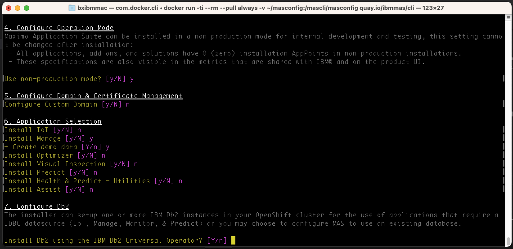

If you use the the Ansible playbooks, you can take the following steps to apply demo data. This option has not been fully tested.

### Update the ManageWorkspace custom resource 

Navigate to CustomResourceDefinitions under Administration from the OpenShift console. Search and find the custom resource, ManageWorkspace. The CR resource is created after MAS Manage activation.

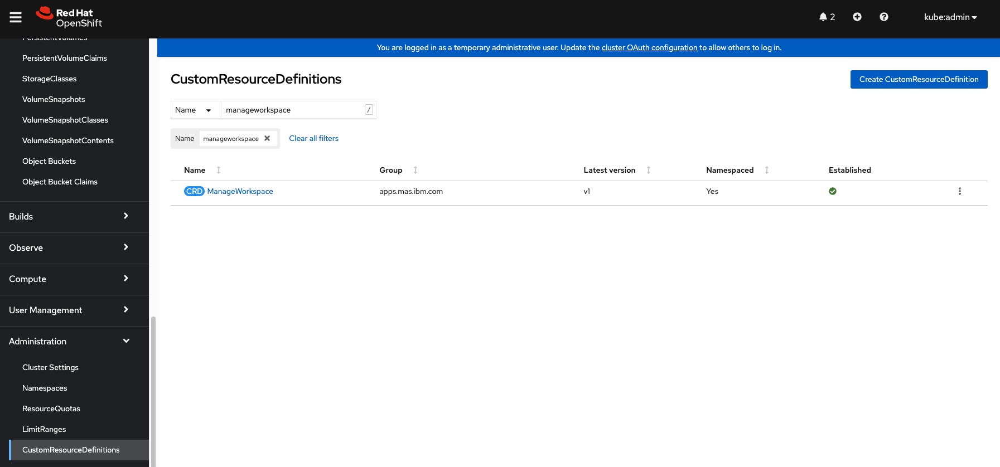

Open the YAML screen and update the "demodata" value at line 68 from "false" to "true".

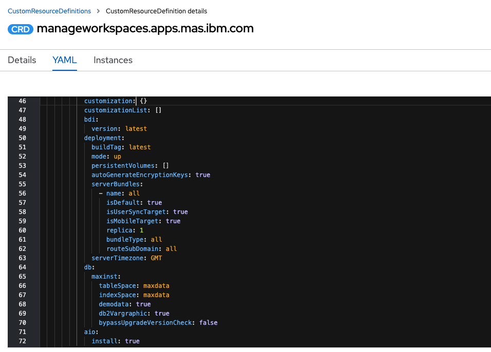

### Update the database in the pod

For DB2, the default user name is db2inst1. The database password is created and stored in the pod named something like  "c-db2inst-instancepassword". Make a note of it for use later.

To the the pod named something like "c-db2inst-db2u-0" in the namespace of "db2u". Navigate to the Terminal tab of the pod. Connect to DB2 with the default username and password. Delete the maxvars table in the Maximo schema, which contains 1271 or so tables. The maxvars table will be re-created and demo data added once Maximo Manage is reconciled.

```
su db2inst1
db2 connect to BLUDB user db2inst1 using <password>
db2 list tables for schema MAXIMO
db2look -d BLUDB -e -t MAXIMO.MAXVARS
db2
  select varname from maximo.maxvars
  drop table maximo.maxvars;
  quit
exit
```

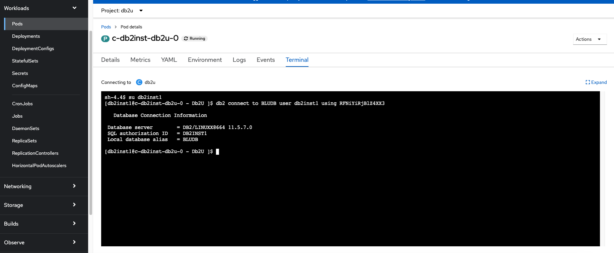

## Install Maximo Using MAS CLI (AWS only)

For Maximo deployment on AWS, you can run the cli command below. As an option, you can include demo data. Both MAS Manage and Health are installed.

One benefit of using the CLI command line is that the entire installation process is fully automated once you provide the required values upfront. The tradeoff is that it does not provide the flexibilities that Ansible playbooks do. It's worth noting that the MAS CLI command is using the same Ansible playbooks behind the scenes.

Note that the "mas install" command does not work on Azure due to missing cluster ingress cert secret name.

```
mas install
```
It will first install the OpenShift pipelines operator, create the pipelines for Maximo deployment and complete required tasks in the pipelines. You are prompted to input the required values. 

Log in to the OpenShift cluster, and find the login credentials from the OpenShift console. Copy the server URL and token.

At step 3:
```
3. Configure Installation
MAS Instance ID > aws1
MAS Workspace ID > masdev1
MAS Workspace Display Name > masdev1
Use online catalog? [y/N] y
MAS Version:
  1. 8.9
  2. 8.8
Select Subscription Channel > 1
```

At step 4:
```
4. Configure Operation Mode
Maximo Application Suite can be installed in a non-production mode for internal development and testing, this setting cannot be changed after installation:
 - All applications, add-ons, and solutions have 0 (zero) installation AppPoints in non-production installations.
 - These specifications are also visible in the metrics that are shared with IBM® and on the product UI.

Use non-production mode? [y/N] y
```

At step 5:
```
5. Configure Domain & Certificate Management
Configure Custom Domain [y/N] n
```

At step 6:
```
6. Application Selection
Install IoT [y/N] n
Install Manage [y/N] y
+ Create demo data [Y/n] y
Install Optimizer [y/N] n
Install Visual Inspection [y/N] n
Install Predict [y/N] n
Install Health & Predict - Utilities [y/N] n
Install Assist [y/N] n
```
At step 7:
```
7. Configure Db2
The installer can setup one or more IBM Db2 instances in your OpenShift cluster for the use of applications that require a JDBC datasource (IoT, Manage, Monitor, & Predict) or you may choose to configure MAS to use an existing database.

Install Db2 using the IBM Db2 Universal Operator? [Y/n] y
 
6.1 Db2 for IoT
Maximo IoT requires a shared system-scope Db2 instance because others application in the suite require access to the same database source.

IoT Db2 instance will not be created because the application is not being installed

6.2 Db2 for Manage
Maximo Manage can be configured to share the system Db2 instance or use it's own dedicated database:
 - Use of a shared instance has a significant footprint reduction but is only recommended for development/test/demo installs
 - In most production systems you will want to use a dedicated database

Dedicated Manage Db2 instance will be created because IoT is not being installed

6.3 Database CPU & Memory
Note that the same settings are applied to both the IoT and Manage Db2 instances, it will be possible to set these independently in a future update.

    CPU Request:    4000m
    CPU Limit:      6000m
    Memory Request: 8Gi
    Memory Limit:   12Gi

Customize CPU and memory request/limit? [y/N] n
 
6.4 Database Storage Capacity
Note that the same settings are applied to both the IoT and Manage Db2 instances, it will be possible to set these independently in a future update.

     - Meta:             20Gi
     - Data:             100Gi
     - Backup:           100Gi
     - Temp:             100Gi
     - Transaction Logs: 100Gi

Customize storage capacity? [y/N] n
```

At step 8:
```
8. Additional Configuration
Additional resource definitions can be applied to the OpenShift Cluster during the MAS configuration step.
The primary purpose of this is to apply configuration for Maximo Application Suite itself, but you can use this to deploy ANY additional resource into your cluster.

Use additional configurations? [y/N] n
```

At Step 9:
```
9. Configure Storage Class Usage
Maximo Application Suite and it's dependencies require storage classes that support ReadWriteOnce (RWO) and ReadWriteMany (RWX) access modes:
  - ReadWriteOnce volumes can be mounted as read-write by multiple pods on a single node.
  - ReadWriteMany volumes can be mounted as read-write by multiple pods across many nodes.

Storage provider auto-detected: OpenShift Container Storage
  - Storage class (ReadWriteOnce): ocs-storagecluster-ceph-rbd
  - Storage class (ReadWriteMany): ocs-storagecluster-cephfs
 
Choose your own storage classes anyway? [y/N] n
```

At Steps 10-12:
```
10. Configure IBM Container Registry
Re-use saved IBM Entitlement Key? [Y/n] y
 
11. Configure Product License
License ID > 756A06D0C216
License File > /mascli/masconfig/license.dat
 
12. Configure UDS
UDS Contact Email > xxx.xue@xxx.com
UDS Contact First Name > xxx
UDS Contact Last Name > xxx
```

At step 13:
```
13. Prepare Installation
If you are using using storage classes that utilize 'WaitForFirstConsumer' binding mode choose 'No' at the prompt below

Wait for PVCs to bind? [Y/n] y
```

At step 14:
```
14. Review Settings

    IBM Maximo Application Suite
    Instance ID ............... aws1
    Workspace ID .............. masdev1
    Workspace Name ............ masdev1
    Operation Mode ............ Non-production
    Catalog Source ............ ibm-operator-catalog
    Subscription Channel ...... 8.9.x
    IBM Entitled Registry ..... cp.icr.io/cp
    IBM Open Registry ......... icr.io/cpopen
    Entitlement Username ...... cp
    Entitlement Key ........... eyJ0eXAi<snip>
 
    IBM Maximo Application Suite Applications
    IoT ...................... Skip Installation
     - Monitor ............... Skip Installation
    Manage ................... 8.5.x (workspace-application JDBC Config)
     - Predict ............... Skip Installation
    H & P Utilities .......... Skip Installation
    Assist ................... Skip Installation
    MVI ...................... Skip Installation
 
    IBM Suite License Service
    Catalog Source ............ ibm-operator-catalog
    License ID ................ 756A06D0C216
    License File .............. /workspace/entitlement/license.dat
    IBM Entitled Registry ..... cp.icr.io/cp
    IBM Open Registry ......... icr.io/cpopen
    Entitlement Username ...... cp
    Entitlement Key ........... xxx<snip>
 
    IBM User Data Services
    Contact Email ............. xxx.xue@xxx.com
    First Name ................ xxx
    Last Name ................. xxx
 
    IBM Db2
    System Instance ........... none
    Dedicated Manage Instance . install
    CPU Request ............... 4000m
    CPU Limit ................. 6000m
    Memory Request ............ 8Gi
    Memory Limit .............. 12Gi
    Meta Storage .............. 20Gi
    Data Storage .............. 100Gi
    Backup Storage ............ 100Gi
    Temp Storage .............. 100Gi
    Transaction Logs Storage .. 100Gi
 
    Storage Class Configuration
    Storage Class Provider ... ocs
 
Proceed with these settings [y/N] y
```

At step 15:
```
15. Launch Installation
Installation started successfully

View progress:
  https://console-openshift-console.apps.xxx.h18p.p1.openshiftapps.com/pipelines/ns/mas-aws1-pipelines
```

You can check the installation status from the OpenShift console. 

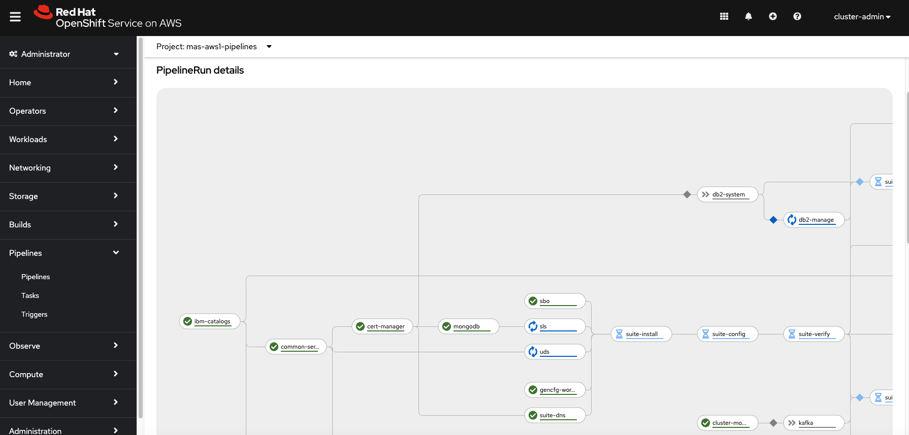

## Estimate Maximo License Requirements for Dev or Test Environment

Assuming that we install Maximo Manage only, with 2 administrators and 8 concurrent users, we will need approximately 150 AppPoints. 

| **Users**                    | **AppPoints** | **Quantity** | **Total** |
| ---------------------------- | ------------- | ------------ | --------- |
| Administrator user (Premium) | 15            | 2            | 30        |
| Application user (Premium)   | 15            | 8            | 120       |
|                              |               |              |           |
| Grand Total AppPoints        |               |              | **150**   |

Premium concurrent users consume 15 AppPoints, with the same login/logout logic.
- Premium users have all the privileges of both base and limited users, plus Manage Industry Solutions (O&G, Aviation, Transportation, Utilities, Nuclear, Civil Infrastructure) and add-ons, Predict, Health and Predict – Utilities, and Visual Inspection.
- Said in an easier way, premium users have access to everything in the MAS suite.
 
Premium administrator users consume 15 AppPoints.
- Application administrators administrate one or more applications, adds and assigns users to these applications, and uses the application-specific user interfaces to manage further user privileges.
- Suite administrator manages overarching system configuration settings from the suite administration pane.

## Maximo Capacity Planning and Cost Estimates

For requirements and capacity planning, refer to the IBM documentation and [download the calculator](https://www.ibm.com/docs/en/mas-cd/continuous-delivery?topic=suite-requirements-capacity-planning).

For cost estimates on OpenShift clusters, excluding licensing fees, consider the following factors.

- Cluster size: small, medium and large
- Storage types and sizes
- Networking e.g. ExpressRoute
- Database

### Maximo Costs on AWS

You can find [Maximo pricing on AWS](https://aws.amazon.com/marketplace/pp/prodview-aehjeun4gvcis#pdp-pricing).

### Maximo Costs on Azure

You can use the Azure pricing calculator to estimate costs for an OpenShift cluster on Azure. 

For pricing of managed OpenShift clusters on Azure, check the [pricing](https://azure.microsoft.com/en-us/pricing/details/openshift/#pricing).

Below is an example for a medium sized, managed OpenShift cluster on Azure.

| Instance            | vCPU(s)     | RAM    | Linux VM Price         | OpenShift   | Cluster size | Pay As You Go Total Price | 1 Year Reserved | 3 Year Reserved | Total (1 yr reserved) | Total (3yr reserved) |
| ------------------- | ----------- | ------ | ---------------------- | ----------- | ------------ | ------------------------- | --------------- | --------------- | --------------------- | -------------------- |
| Total Price         | Total Price |        |                        |
| D8s v3              | 8           | 32 GiB | Up to 100 worker nodes | $0.44/hour  | 3            |                           | $0.28           | $0.18           | $632.93               | $411.54              |
| D16as v4            | 16          | 64 GiB | $0.868/hour            | $0.684/hour | 5            | $1.55                     | $0.98           | $0.65           | $3,720.20             | $2,462.78            |
|                     |             |        |                        |             |              |                           |                 |                 |                       |                      |
| Monthly Grand Total |             |        |                        |             |              |                           |                 |                 | $4,353.13             | $2,874.32            |

Below is an example for a medium sized, unmanaged OpenShift cluster on Azure.

 | Service category | Service type       | Custom name | Region  | Description                                                                                                                                                                                                                                                                                                     | Estimated monthly cost | Estimated upfront cost |
| ---------------- | ------------------ | ----------- | ------- | --------------------------------------------------------------------------------------------------------------------------------------------------------------------------------------------------------------------------------------------------------------------------------------------------------------- | ---------------------- | ---------------------- |
| Compute          | Virtual Machines   |             | West US | 3 D8s v4 (8 vCPUs, 32 GB RAM) (1 year savings plan), Linux,  (Pay as you go); 0 managed disks – S4; Inter Region transfer type, 5 GB outbound data transfer from West US to East Asia                                                                                                                           | $789.21                | $0.00                  |
| Compute          | Virtual Machines   |             | West US | 5 D16s v4 (16 vCPUs, 64 GB RAM) (1 year savings plan), Linux,  (Pay as you go); 0 managed disks – S4; Inter Region transfer type, 5 GB outbound data transfer from West US to East Asia                                                                                                                         | $2,630.70              | $0.00                  |
| Storage          | Storage Accounts   |             | West US | File Storage, Premium Performance Tier, LRS Redundancy, 10 TiB of Data at-rest, (One Year Reserved), 1 TiB Snapshots, 0 Additional Sync Server(s)                                                                                                                                                               | $153.60                | $17,734.00             |
| Storage          | Storage Accounts   |             | West US | Block Blob Storage, General Purpose V2, Flat Namespace, LRS Redundancy, Hot Access Tier, 10 TB Capacity - Pay as you go, 10 x 10,000 Write operations, 10 x 10,000 List and Create Container Operations, 10 x 10,000 Read operations, 1 x 10,000 Other operations. 1,000 GB Data Retrieval, 1,000 GB Data Write | $214.14                | $0.00                  |
| Networking       | Azure ExpressRoute |             |         | ExpressRoute, Zone 1, Premium, Metered; 1 Gbps Circuit X 1 circuit, 0 GB in Additional Outbound Data Transfer; Global Reach Add On: Disabled                                                                                                                                                                    | $1,186.00              | $0.00                  |
| Compute          | Virtual Machines   |             | West US | 1 D2s v4 (2 vCPUs, 8 GB RAM) (1 year savings plan), Linux,  (Pay as you go); 0 managed disks – S4; Inter Region transfer type, 5 GB outbound data transfer from West US to East Asia                                                                                                                            | $65.77                 | $0.00                  |
| Total            |                    |             |         |                                                                                                                                                                                                                                                                                                                 | 5039.4174              | $17,734.00             |

 ## Contributors

 Many thanks to my colleagues Jenny Wang, Sina Nikmaram, Mir Farhan Ali and Darnele Pierre-Louis for their assistance in the project. I am deeply indebted to them for their kindness and expert knowledge.